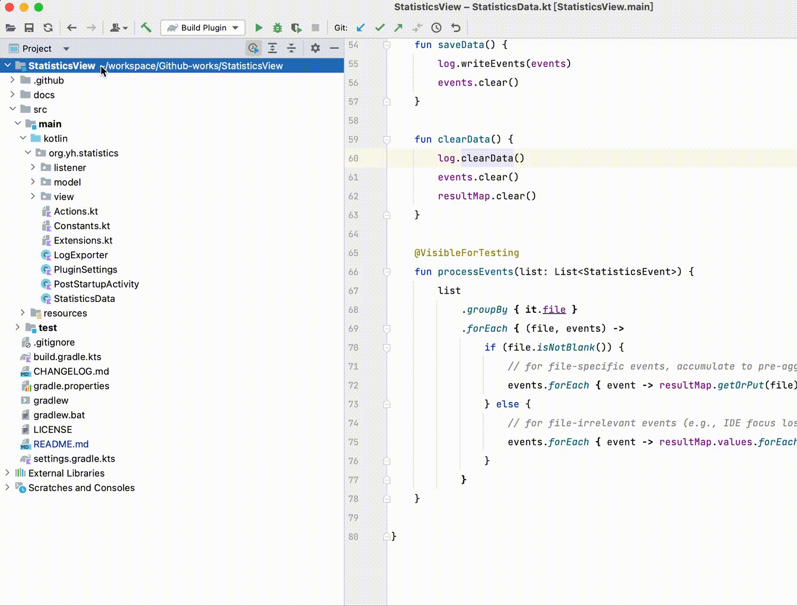
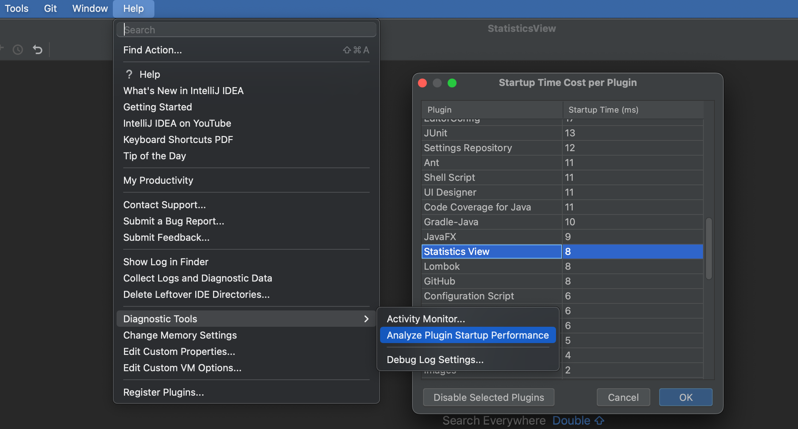
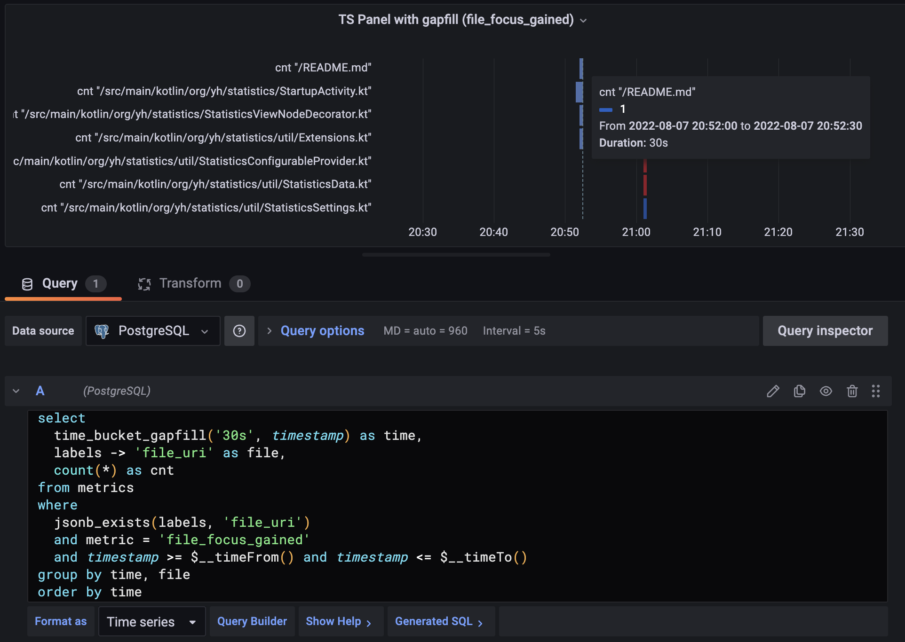

Statistics View IntelliJ Plugin
===

[![Build][github-action-svg]][github-action-build]
[![Version][plugin-version-svg]][plugin-repo]
[![Downloads][plugin-downloads-svg]][plugin-repo]
[![Rating][plugin-rating-svg]][plugin-repo]

<!-- Plugin description -->
**StatisticsView** IntelliJ plugin enables logging IDE code browsing activities and shows aggregated statistical information (e.g. accumulated file opened times) in the IDE Project view.

The plugin aims to provide some helpful insight into IDE users' productivity. You can also do some data mining & visualizations base on the raw event logs.

More information can be found on [GitHub](https://github.com/yaohui-wyh/StatisticsView).

<!-- Plugin description end -->



## Installation

- **StatisticsView** can be installed from an IntelliJ IDE via `Settings | Plugins`. See the [detailed instructions](https://www.jetbrains.com/help/idea/managing-plugins.html#) from the JetBrains guide.
- Alternatively, download the latest plugin zip file from the [GitHub release](https://github.com/yaohui-wyh/StatisticsView/releases/latest) and install manually via `Settings | Plugins | Install plugin from disk`

## Usage

The plugin registers a title bar button in the **Project** tool window, which provides the following menu options:

- **Enable Logging**: activate/deactivate logging for the current IDE project. The title bar button is displayed in the toggled state when activated, thus users could have fewer worries about unexpected background logging behaviors.
- Project View:
    - **Show File Statistics**: show/hide aggregated statistical information of each file, e.g. "Last viewed" summary information and accumulated file viewed duration. When IDE frame is deactivated, the duration time is not accounted for.
    - **Show Directory Statistics**: show the percentage of viewed files in each directory.
    - **Hide Viewed Files**: hide viewed files from the Project view. Empty middle directories are also hidden.
- Statistics Data:
    - **Clear Statistics Data**: clear old raw events and pre-aggregated results for the current project. Note that it doesn't turn off logging simultaneously. Be careful that this operation is unrecoverable.
    - **Show Data File**: locate the current project's event log file in Finder/Explorer.

## How it works

This plugin is highly inspired by [**activity-tracker**](https://github.com/dkandalov/activity-tracker) as well as some components of the [**intellij-community**](https://github.com/JetBrains/intellij-community) project. Apart from recording events, **StatisticsView** tries to provide some real-time analytical features integrated with the IDE, e.g. adding additional info in the Project view.

### Event

StatisticsView subscribes to [listeners](https://plugins.jetbrains.com/docs/intellij/plugin-listeners.html) provided by the IntelliJ Platform for various IDE events, such as file opened, code completion, jump to definition, etc.

> For current version (1.0.0) StatisticsView only handles file opened/closed & IDE activated/deactivated events.

Whenever an event is received, StatisticsView records the event type, timestamp, and fileUri (only if the event is file related). StatisticsView won't process events for files that are not valid source files (e.g. binary files, library folders, intentionally "marked as excluded" directories would be ignored).

### Data storage

StatisticsView saves events directly to a disk file to ensure minimal dependency. This brings some limitations, such as it could be impossible to make complex queries on the file-based datasets, e.g. filter by time range, group by directory, etc. Since we need to show summarized information in real-time in the IDE Project view, the query could only be performed against some pre-aggregated data structure in memory.

The write load is relatively low (10+ writes per second at most after debounced / dedup) and events could be safely queued on a file writer and saved to disk periodically in the background thread which would not impact IDE performance.

> This pre-aggregated hashMap + async file writer practice couldn't handle back-filling situations: e.g. when the user performs a file renamed action in IDE, events with the previous fileUri should be updated.

So if you are accumulating the event logs for a very long period of time, better migrate the raw data into some external data storage (e.g. TSDB) and perform your data analysis offline.

### Data format

> For the current version (1.0.0), each event is serialized into JSON string format, which could change in future versions.

JSON serialization is picked by its simplicity (provided by `kotlinx.serialization` API out-of-box), and it is easier to parse line by line via shell scripts.

Example of log file:

```
{"ts":1661075776169,"action":"IDE_ACTIVATED","file":"","tags":{}}
{"ts":1661075789662,"action":"FILE_OPENED","file":"/README.md","tags":{"FILE_LINE_OF_CODE":"14"}}
{"ts":1661075798429,"action":"FILE_CLOSED","file":"/README.md","tags":{"FILE_LINE_OF_CODE":"14"}}
{"ts":1661075798429,"action":"FILE_OPENED","file":"/src/main/kotlin/org/yh/statistics/listener/MyFileEditorManagerListener.kt","tags":{"FILE_LINE_OF_CODE":"49"}}
{"ts":1661075799293,"action":"FILE_CLOSED","file":"/src/main/kotlin/org/yh/statistics/listener/MyFileEditorManagerListener.kt","tags":{"FILE_LINE_OF_CODE":"49"}}
{"ts":1661075839459,"action":"FILE_OPENED","file":"/src/main/kotlin/org/yh/statistics/view/MyViewTreeStructureProvider.kt","tags":{"FILE_LINE_OF_CODE":"43"}}
{"ts":1661075841073,"action":"FILE_CLOSED","file":"/src/main/kotlin/org/yh/statistics/view/MyViewTreeStructureProvider.kt","tags":{"FILE_LINE_OF_CODE":"43"}}
{"ts":1661075841073,"action":"FILE_OPENED","file":"/src/main/kotlin/org/yh/statistics/view/MyViewNodeDecorator.kt","tags":{"FILE_LINE_OF_CODE":"71"}}
{"ts":1661075850804,"action":"IDE_DEACTIVATED","file":"","tags":{}}
```

## Impact on IDE (FAQ)

### Performance

1. If I `enable logging` all the time, will it slow down IDE startup?
    - No. Long-running & IO-bound tasks (e.g. serialize/deserialize events data, R/W log file) are executed on the pooled thread and will not affect the IDE responsiveness. You can check the startup cost for plugins using the IntelliJ IDE's built-in diagnostic tools: `IDE Help | Diagnostic Tools | Analyze Plugin Startup Performance`:
    - 
    - IDE events handling are performed in the event dispatch thread (EDT) which will not block the UI thread.
2. Since events keep accumulating, will they eat up my memory?
    - The raw events are queued in memory and written to the disk file periodically, and once the writing is done, they are cleared from the queue and got garbage collected.
3. The only negative performance impact is the Project view if you turn on `Show File Statistics`/`Show Directory Statistics` which adds statistical information next to each file/directory node. The ProjectView rendering finishes instantly most of the time, however if the project consists of a huge amount of files, the total rendering cost could be significant. If you encounter some sluggishness with the Project view, just turn off the `Show ... Statistics` actions, and turn on them when you need to see the statistical information.

### Data

1. Where is the raw event log stored?
    - The raw event log (`stat.log`) is saved in the project `.idea` folder, and IDE doesn't need your permission to read/write from somewhere other than the current project's folder. It's by nature project-wide, and you won't bother cleaning up the log once you delete the IDE project. It would also be less likely to mess up your VCS since most projects' `.idea` folder is already ignored.
2. Can I safely share the log file with someone else?
    - Sure. No personal identity information (e.g. username, hostname) is logged, and all `fileUri` are saved as the relative path to the project root.
3. Any telemetry or data reporting?
    - No and never.
4. Log rotation / data compression
    - Will be provided in v1.0.2.

## Data analysis & IDE productivity [WIP]

> Note: most of this part is not closely related to the duty of the StatisticsView plugin. There are many similarities between IDE code activities and microservices observability concepts.

### Import event data into PostgreSQL [Experimental]

checkout [data-analysis-poc](./data-analysis-poc) for a k8s manifest for importing event logs into PostgreSQL and visualizing in Grafana dashboard



## Acknowledgment

- Thank [@dkandalov] for creating the awesome plugin [activity-tracker](https://github.com/dkandalov/activity-tracker).
- Thank [@unknwon] for helping with documentation and guides for the OSS project structure.

<!-- Badges -->

[github-action-build]: https://github.com/yaohui-wyh/StatisticsView/actions/workflows/build.yml
[github-action-svg]: https://github.com/yaohui-wyh/StatisticsView/actions/workflows/build.yml/badge.svg
[plugin-repo]: https://plugins.jetbrains.com/plugin/19747-statistics-view
[plugin-downloads-svg]: http://img.shields.io/jetbrains/plugin/d/19747
[plugin-rating-svg]: http://img.shields.io/jetbrains/plugin/r/stars/19747
[plugin-version-svg]: https://img.shields.io/jetbrains/plugin/v/19747?label=version

<!-- Badges -->

[@dkandalov]: https://github.com/dkandalov
[@unknwon]: https://github.com/unknwon