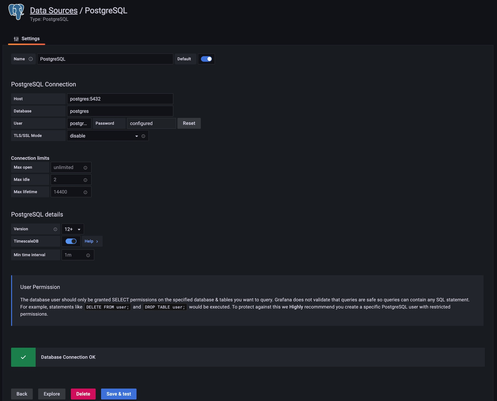
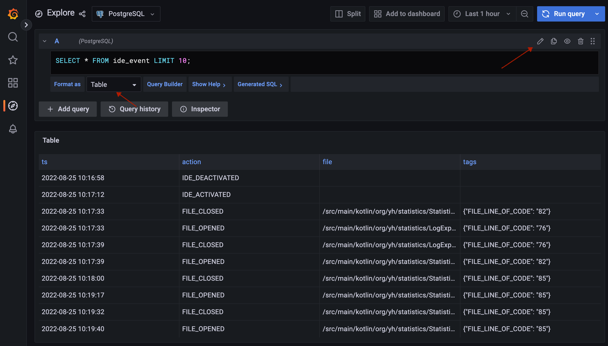

## About

This is a proof-of-concept data analytics stack (using [Kustomize](https://kubernetes.io/docs/tasks/manage-kubernetes-objects/kustomization/)), which includes deployments of:

- [TimescaleDB](https://www.timescale.com/) (an extension on top of PostgreSQL) with an [SQL script](./kustomize/postgres/100_init.sql) converting raw IDE event logs to the normalized event table
- [Grafana](https://grafana.com/) for data visualization

> To run this, you will need a working Kubernetes cluster, and access via [kubectl](https://kubernetes.io/docs/tasks/tools/) (at least version 1.14, otherwise you need to install the standalone [kustomize](https://kustomize.io/) command-line tool). To deploy and run all the workloads, you will need about 2 CPU cores and 2GB RAM available in your k8s cluster.

### Setup

1. Copy your IDE project's `stat.log` to `<project-root>/data-analysis-poc/kustomize/postgres/stat.log`. You can locate the `stat.log` file in your system file manager via the plugin's `Show Data File` action.
2. Apply the manifests by running `kubectl -k <project-root>/data-analysis-poc/kustomize`:

    ```
    $ kubectl -k ./data-analysis-poc/kustomize
    configmap/ide-data-log-kfkbf22df7 created
    configmap/init-sql-cmfcc6kc2k created
    service/grafana created
    service/postgres created
    deployment.apps/grafana created
    deployment.apps/postgres created
    ```
3. Wait for all workloads to be ready: `kubectl get pod -w`
    ```
    NAME                       READY   STATUS    RESTARTS   AGE
    grafana-669f94f445-9cg9n   1/1     Running   0          8m44s
    postgres-96bd574d-2pgdj    1/1     Running   0          8m44s
    ```
4. Connect to Grafana web server via port-forward: `kubectl port-forward service/grafana 3000`

    ```
    Forwarding from 127.0.0.1:3000 -> 3000
    Forwarding from [::1]:3000 -> 3000
    ```
5. Now Grafana can be visited from your browser: `http://localhost:3000`. Enter `admin` for username and password (checkout more at [Sign in to Grafana](https://grafana.com/docs/grafana/latest/setup-grafana/sign-in-to-grafana/))
6. Create a PostgreSQL Datasource with settings:
    - PostgreSQL Connection
        - Host: `postgres:5432`
        - Database: `postgres`
        - User: `postgres` | Password: `postgres`
        - TLS/SSL Mode: `disabled`
    - PostgreSQL details
        - versions: `12+`
        - TimescaleDB: `enabled`
    - 
7. Now you can explore the datasets by running some SQL
    - 
8. You can create a Grafana dashboard, such as using a State Timeline panel to visualize how IDE file open events change over time.
    - 
    - a sample query with TimescaleDB hyperfunctions `time_bucket`, `first`, `last`. Some great tutorials can be found at [Getting Started with Grafana and TimescaleDB](https://docs.timescale.com/timescaledb/latest/tutorials/grafana/)

       ```sql
       SELECT
          time_bucket('30s', ts) AS time,
          file,
          count(*) AS cnt
       FROM
          (SELECT first(ts, ts) AS s, last(ts, ts) AS e FROM ide_event) AS time_range,
          ide_event
       WHERE
          file != ''
          AND ts >= time_range.s
          AND ts <= time_range.e
       GROUP BY time, file
       ORDER BY time
       ```

### Debug

#### 1. TimescaleDB (Postgres) Pod failed to start

- this is mostly caused by invalid `stat.log` (e.g. unexpected empty lines), check the log via `kubectl logs pod <postgres-pod>`. If the `stat.log` is parsed and imported properly, you could see the init script executed with logs:

   ```
   ...
   /usr/local/bin/docker-entrypoint.sh: running /docker-entrypoint-initdb.d/100_init.sql
   CREATE TABLE
   COPY 814
   SELECT 814
   ...
   ```

#### 2. Grafana failed to run queries

- Check if the query (raw SQL) could be executed properly. You could `kubectl exec` onto the postgres Pod and use `psql` to open up a SQL console.
- In case Grafana web service is unreachable: rerun service `port-forward` and try visiting Grafana again (the kubectl port-forwarding connection could be broken/dropped).
